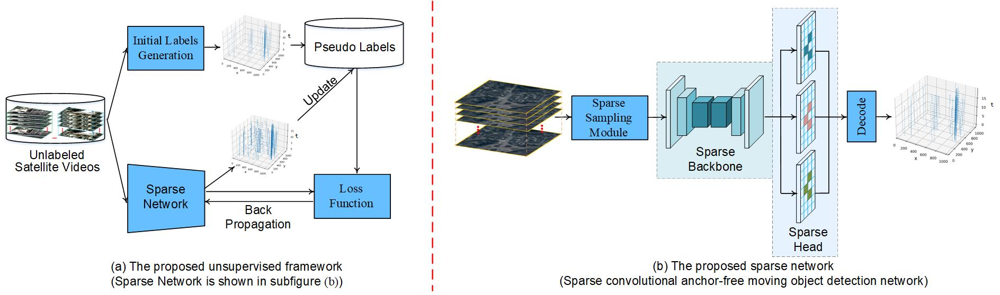
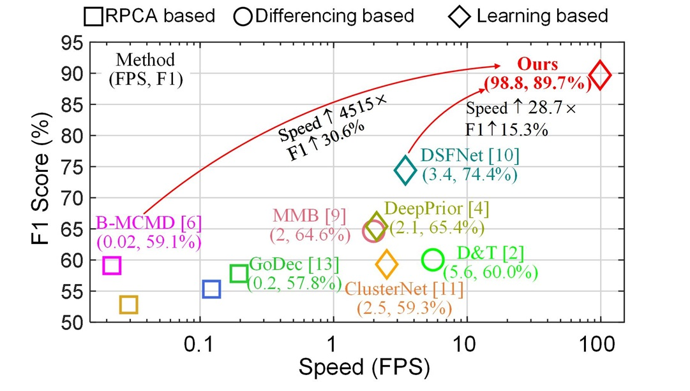

# Highly Efficient and Unsupervised Framework for Moving Object Detection in Satellite Videos



## Algorithm Introduction

This is an implementation for paper "Highly Efficient and Unsupervised Framework for Moving Object Detection in Satellite Videos" (Chao Xiao, Wei An, Yifan Zhang, et. al., Highly Efficient and Unsupervised Framework for Moving Object Detection in Satellite Videos, TPAMI 2024).

We propose a highly efficient unsupervised framework for moving object detection in satellite videos (SVMOD). Specifically, we propose a generic unsupervised framework for SVMOD, in which pseudo labels generated by a traditional method can evolve with the training process to promote detection performance. Furthermore, we propose a highly efficient and effective sparse convolutional anchor-free detection network by sampling the dense multi-frame image form into a sparse spatio-temporal point cloud representation and skipping the redundant computation on background regions. Coping these two designs, we can achieve both high efficiency (label and computation efficiency) and effectiveness. Extensive experiments demonstrate that our method can not only process 98.8 frames per second on 1024X1024 images (at a single RTX 2080Ti) but also achieve state-of-the-art performance.



## Prerequisite
* Tested on Ubuntu 20.04, with Python 3.7, PyTorch 1.7, Torchvision 0.8.1, CUDA 10.2, and 2x NVIDIA 2080Ti.
* You can follow [DSFNet](https://github.com/ChaoXiao12/Moving-object-detection-DSFNet) to build the environment. But DCNv2 is not used in this code and you can ignore it.
* Install the [spconv](https://github.com/traveller59/spconv) and you can run this code.

## Usage

#### On Ubuntu:
#### 1. Train.
```bash
python train_sp_update.py --task ctdet_points --model_name sp_centerDet_minus --layers 3 --datasetname rs_car --data_mode multi --data_dir ./datasets/RsCarData/ --gpus 0 --exp_name unsupervised_iterative_ --sup_mode 3 --unsup_iter 10 --off_flag True --down_ratio 1 --seqLen 20 --conf_filtered 0.2 --val_intervals 5 --lr 1.25e-4 --lr_step 30,45 --num_epochs 55 --batch_size 6 --data_sampling 5
```

#### 2. Test.
```bash
python test.py --task ctdet_points --model_name sp_centerDet_minus --layers 3 --gpus 0 --datasetname rs_car --data_mode multi --data_dir ./datasets/RsCarData/ --sup_mode 3 --unsup_iter 10 --off_flag True --down_ratio 1 --seqLen 20 --gpus 0 --load_model ./weights/trained_model/model_best.pth 
```

## Quantative Results 

Quantitative results of different models evaluated by Recall (Re), Precision (Pr) and F1 score (F1). You can download the trained model weights and put it to the weights folder.

|  Models     | Avg Re (%)|Avg Pr (%)|Avg F1 (%)|
|--------------|-----------|-----|-----|
| HiEUM-sup    |     71.0     |98.2     |82.1     |
| HiEUM-unsup  |     60.3     |97.5     |74.1     |
| HiEUM        |     84.2     |96.1     |89.7     |

* Note that, HiEUM is highly efficient and can achieve nearly 100 FPS at a single RTX 2080Ti GPU and 250 FPS at a single RTX 2090Ti GPU for a 1024*1024 image.

* The trained weight is available at [[BaiduYun](https://pan.baidu.com/s/1uZxeJiIRl4OIEZWXG8M0fw?pwd=bxwv)](Sharing code: bxwv). You can download the model and put it to the weights folder.

* The dataset is available at [[BaiduYun](https://pan.baidu.com/s/16a2NmJuWeZ4Ywn0MKiF6Vg?pwd=s662)](Sharing code: s662). You can download the dataset and put it to the data folder.

## Citation
If you find the code useful, please consider citing our paper using the following BibTeX entry.
```
@article{xiao2024highly,
  title={Highly Efficient and Unsupervised Framework for Moving Object Detection in Satellite Videos},
  author={Xiao, Chao and An, Wei and Zhang, Yifan and Su, Zhuo and Li, Miao and Sheng, Weidong and Pietik{\"a}inen, Matti and Liu, Li},
  journal={IEEE Transactions on Pattern Analysis and Machine Intelligence},
  year={2024},
  publisher={IEEE}
}
```